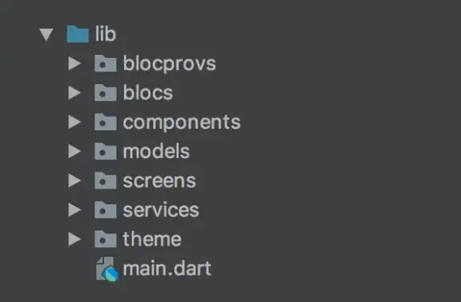

# Structure des fichiers du projet (Client léger)

## Exemple de structure pour dossier `/lib`:

Description des dossiers:
- The `theme` folder just contains a style.dart with my app theme which I access in the main.dart file
- The `services` folder holds some web APIs and native interaction code
- The `components` folder has custom widgets which are used in multiple different screens
- The `models` folder contains files each with a custom class of an object widely used throughout the app
- The `blocs` and `blocprovs` folders are both pretty straightforward, with each holding a file with a BLoC and a BLoC Provider in it respectively (I used this and this video to learn how to structure the files).
- The `screens` folder holds many different folders, each of which corresponds to a different screen of the app. Each screen folder holds two things: a primary screen file which serves to organize each component, and a “components” folder which holds each component in its own separate file. Any piece of a screen more complicated then a few widgets should be its own component.

src: https://medium.com/flutter-community/flutter-code-organization-de3a4c219149
